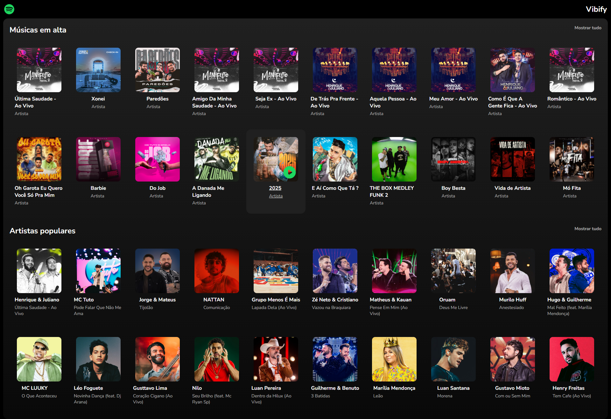

## 💻Vibify: Sua Plataforma Musical Personalizada
Bem-vindo(a) ao Vibify! Um projeto desenvolvido para oferecer uma experiência musical imersiva, onde você pode explorar e interagir com uma vasta coleção de artistas e músicas. Clique e descubra novos sons e curta suas faixas favoritas com um player completo e intuitivo.

✨ Visão Geral do Projeto
Vibify é mais do que apenas um tocador de música. É uma plataforma dinâmica onde o usuário pode:

Navegar por Artistas: Explore uma lista abrangente de artistas, cada um com sua própria página dedicada.
Descobrir Músicas: Acesse a discografia de cada artista e encontre suas músicas.
Player Completo: Desfrute de um player de música com funcionalidades essenciais como play, pause, próxima música e música anterior, proporcionando controle total sobre sua experiência auditiva.
Interação Intuitiva: Uma interface fluida e responsiva, garantindo que a navegação e o uso do player sejam simples e agradáveis.
O coração do Vibify reside na sua capacidade de consumir uma API robusta desenvolvida por você mesmo(a), que se conecta diretamente a um banco de dados MongoDB. Isso garante que todo o conteúdo (artistas e músicas) seja dinâmico e facilmente gerenciável.




🛠️ Tecnologias Utilizadas
Este projeto foi construído utilizando um stack moderno e eficiente, garantindo performance e uma ótima experiência de desenvolvimento e usuário:


 ## :rocket: Tecnologias

Esse projeto foi desenvolvido com as seguintes tecnologias:

✔️Phosphor Icons

✔️JavaScript

✔️React-vite

✔️React Router DOM

✔️Styled-components

✔️Axios

✔️Tippy.js/React

✔️Node.js

✔️MongoDB

✔️Express.js


## ⚙ Configuração

```
- $ git clone https://github.com/diegofchagas/vibify.git

- Para instalar as dependências:
> npm i

- Vá para a pasta do projeto

- Para iniciar a aplicação:
> npm run dev

Configurar o Backend:

Navegue até a pasta do seu backend (ex: cd backend).
Instale as dependências: npm install ou yarn install.
Configure sua string de conexão com o MongoDB (geralmente em um arquivo .env).
Inicie o servidor: npm start ou yarn start.
```

## Desenvolvedor 
<span style="font-size: larger;">**Diego Chagas**</span>